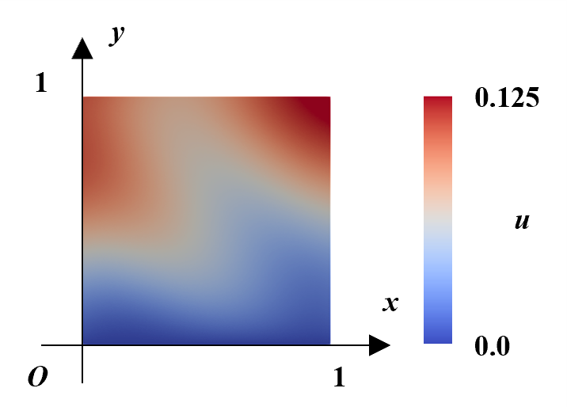
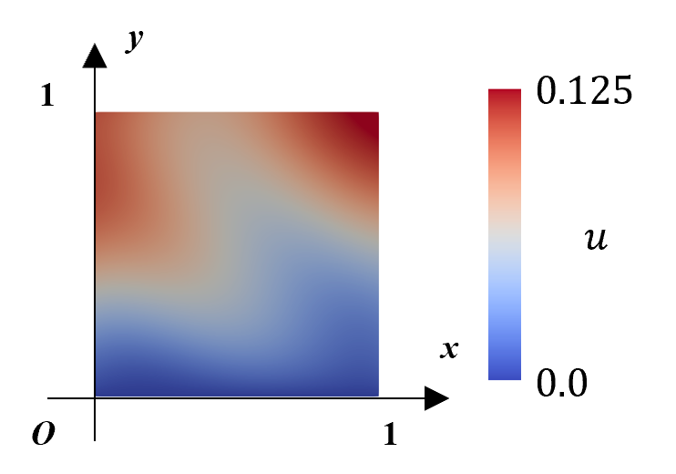

# FreeFEM
FreeFEM & Python (NumPy) code to solve steady heat equation. 

## Code
### FreeFEM
Install [FreeFEM](https://freefem.org/) to execute codes in <code>./src_FreeFEM/</code>. They include meshing arbitrary shape into FEM elements (e.g. <code>01_square.edp</code>), and heat diffusion simulation (<code>99_heat.edp</code>). 

### Python
Dependencies for Python codes are listed in <code>./src_python/requirements.txt</code>. FDM is implemented in <code>heat.py</code>, which execute main FDM simulation and saves the solution as <code>.npy</code> format. One needs to run <code>visualize.py</code> to obtain solution illustration. 

## Solution
The following are simulation results of heat equation whose form is:
$$ \nabla^2 u (x, y) = \sin(2 \pi (x + y)) $$
with boundary conditions being:
$$ u (x, 0) = 0 $$
$$ \frac{\partial u}{\partial n}(x, 1) = 0.05 $$
$$ \frac{\partial u}{\partial n}(0, y) = \frac{\partial u}{\partial n}(1, y) = 0.05 $$

FreeFEM solves above with P1 elements, while NumPy (FDM) takes regular (evenly spaced) orthogonal grid, both divide x- & y- domain into 128 subdomains. 

| FEM (FreeFEM, P1 triangular elements) | FDM (NumPy, regular grid) |
|:---:|:---:|
|||

